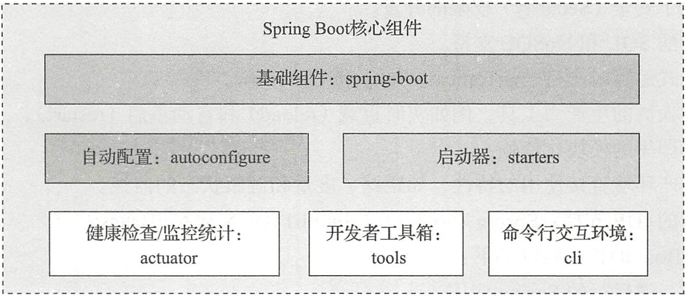

# SpringBoot介绍

## Spring

### Spring微服务系统架构图

### Spring框架核心模块

组成 Spring框架的每个模块（或组件）都可以单独存在，或者与其他一个或多个模块联合实现。下面我们分别介绍

1. 核心容器模块

    核心容器提供 Spring框架的基本功能，包括Core、 Beans、 Context、EL模块。

    Core 模块封装了框架依赖的最底层部分，包括资源访问、类型转换及一些常用工具类。

    Beans 模块中的主要组件是 BeanFactory，它是工厂模式的实现。

    Context 模块是一个配置文件，向 Spring 框架提供上下文信息。

    EL 模块提供强大的表达式语言支持。

2. AOP 、Aspects 模块
   
   AOP 模块提供了符合 AOP Alliance 规范的面向切面的编程实现，提供比如日志记录、权限控制、性能统计等通用功能和业务逻辑分离的技术，并且能动态地把这些功能添加到需要的代码中；这样各专其职，可降低业务逻辑和通用功能的搞合。Aspects 模提供了对AspectJ 的集成， AspectJ 提供了比Spring ASP 更强大的功能。

3. 数据访问／ 集成模块

   该模块包括JDBC 、ORM 、OXM 、JMS 和事务模块（ Transactions ） 。

   事务模块用于Spring 管理事务，只要是Spring 管理对象都能得到 Spring 管理事务的好处，无须在代码中进行事务控制了，而且支持编程和声明性的事务管理。

   JDBC 模块提供了一个JBDC 的样例模板，使用这些模板能消除传统冗长的JDBC 编码还有必须的事务控制，而且能享受到Spring 管理事务的好处。

   ORM 模块提供与流行的“对象－关系映射” ORM 框架的无缝集成，包括Hibernate 、JPA 、MyBatis 等。

   OXM 模块提供了一个对 Object/XML 映射实现，将 Java 对象映射成却也数据，或者将 XML 数据映射成Java 对象， Object/XML 映射实现包括JAXB 、Castor 、XMLBeans 和XStrearn。

   JMS （Java Messaging Service）模块提供一套“消息生产者、消息消费者”模板以便更加简单地使用JMS, JMS 用于在两个应用程序之间，或分布式系统中发送消息，进行异步通信。

4. Web/Remoting 模块
   
   Web/Remoting 模块包含Web 、Web-Servlet 、Web-Struts 、Web-Porlet 模块。

   Web 模块提供了基础的Web 功能。例如多文件上传、集成 IoC 容器、远程过程访问（RMI、Hessian、Burlap）以及 Web Service 支持，并提供一个 RestTemplate 类来提供方便的 Restful services 访问。

   Web Servlet 模块提供了一个Spring MVC Web 框架实现。

   Web Struts 模块提供了与 Struts 无缝集成， Strutsl.x 和Struts2.x 都支持。

5. Test 模块
   
   Test 模块支持 Junit 和 TestNG 测试框架，而且还额外提供了一些基于 Spring 的测试功能，比如在测试 Web 框架时，模拟 Http 请求的功能。
   
## Spring全家桶

使用Spring Boot 构建一切服务。Spring Boot 旨在让你尽可能快地启动和运行，并极简化Spring 配置。

使用Spring Cloud 协调一切服务。Spring Cloud 使得实现分布式的、微服务风格的架构更加简单。

使用Spring Cloud Data Flow 连接一切服务。Data Flow 将企业服务连接到任何移动设备、传感器、可穿戴设备、汽车等的互联网上。Spring Cloud 数据流提供了一个统一的服务，用于创建地址流和基于 ETL 的数据处理模式、可组合的数据微服务。

### SpringBoot

**SpringBoot核心组件**

1. spring-boot

    Spring Boot 核心工程。
    
2. starters

    是 Spring Boot 的启动服务工程。spring-boot 中内置提供的 starter 列表可以在Spring Boot 项目源代码工程 spring-boot/spring-boot-starters 中看到。这些 starters 的使用例子，在源码中的spring-boot/spring-boot-samples 工程中。

3. autoconfigure

    是Spring Boot 实现自动配置的核心工程。
    
4. actuator

    提供Spring Boot 应用的外围支撑性功能。比如：应用状态监控管理、应用健康指示表、远程 shell 支持、metrics 支持等。

5. tools

    提供了Spring Boot 开发者的常用工具集。诸如， spring-boot-gradle-plugin 、spring-bootmaven-plugin 就在这个模块里面。

6. cli

    是 Spring Boot 命令行交互工具，可用于使用 Spring 进行快速原型搭建。可以用它直接运行 Groovy 脚本。如果你不喜欢 Maven 或 Gradle ，可用 CLI ( Command Line Interface ）来开发运行 Spring 应用程序。可以使用它来运行 Groovy 脚本，甚至编写自定义命令。

### Spring Data JPA

**JPA简介**

Spring Data 项目是 Spring 的一个子项目，旨在统一和简化各类型持久化存储。 Spring Data使得访问数据变得简单，包括关系型和非关系型、并行计算框架、基于云的数据服务等。 Spring Data JPA 是其中之一。

JPA（Java Persistence Api）是Sun官方提出的Java持久化规范，为了简化持久化开发工作和整合ORM技术，结束 Hibernate、TopLink、JDO 等ORM框架各自为营的局面。

核心组成之间的关系：

- EntityManagerFactory 和 EntityManager 的关系是一对多。
- EntityManager 和 EntityTransaction 之间的关系是一对一。对于每个 EntityManager 操作，只有一个 EntityTransaction 实例。
- EntityManager 和 Query 之间的关系是一对多。使用一个 EntityManager 实例可以执行多个查询。
- EntityManager 和 Entity 之间的关系是一对多。一个 EntityManager 实例可以管理多个实体

实例对象的生命周期状态：

- New：新创建的实例对象，没有 identity 值。
- Managed：在持久化上下文中受管理的对象。
- Detached：游离于持久化上下文之外的实例对象。
- Removed：被删除的实例对象。

实体之间的关联关系：

- OneToOne
- OneToMany
- ManyToOne
- ManyToMany

Spring Data JPA、JPA以及ORM框架之间的关系

Spring Data项目的生态

通过SpringData，开发者可以实现Spring提供的CrudRepository来访问位于不同类型的数据存储中的数据。

Spring Data JPA是 Spring Data的子模块。 Spring Data JPA的目标是实现数据访问层代码的极简化，它极大的简化了基于JPA规范的ORM框架的使用。
可以在几乎不用编写任何代码的情况下，实现对数据库的访问和基本CRUD操作，还包括分页、排序等常用的功能。使用 Spring Data JPA，我们只需要通过
实现JPA提供的 Repository接口，就立即拥有了通用的CRUD以及分页、排序等API接口（对应的JPA接口实现框架，如 Hibernate，将会自动实现查询方法）。
如果还需要自定义个性化的查询方法，在接口中直接实现。除了支持面向对象的JPQL语句，还支持原生SQL的查询。不需要XML配置文件，完全使用注解。

**Spring Data JPA 提供的接口**

**JPA 常用注解**

**JPQL语法**

SQL和JPQL之间的主要区别是，SQL直接与关系数据库中的表、记录和字段名称关联；而JPQL与Java实体类对象及其属性名称关联。JPQL是完全面向对象的，具备继承、多态和关联等特性，和 Hibernate HQL很相似。

### SpringMVC

