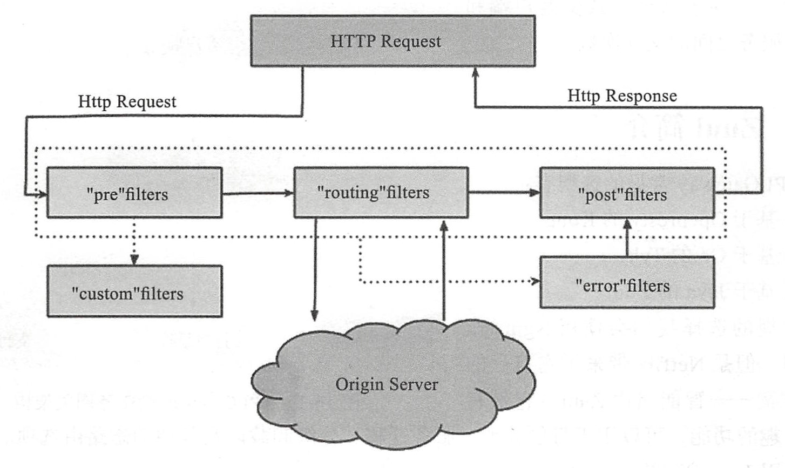

# Zuul

## 1. API GateWay

API Gateway 是随着微服务这个概念兴起的一种架构模式，它用于解决微服务过于分散，没有一个统一的出入口进行流量管理的问题。

不同的微服务一般有不同的网络域名（或IP地址），而通常情况下，在大规模分布式架构系统中，外部的客户端可能需要调用多个服务的接口才能完成一个业务逻辑。比如，在京东上下单购买一个商品的场景，通常会包含数据服务、订单服务、支付服务等。如果客户端直接单独和这些微服务进行通信，可能会存在如下问题口客户端会多次请求不同微服务，增加客户端的复杂性。

口存在跨域请求，在一定场景下处理相对复杂。
口认证复杂，每一个服务都需要独立认证。

诸如上述问题，我们可以引入一个中间代理层— API Gateway来解决。API Gateway 是介于客户端和服务器端之间的中间层，作为微服务网关，所有的外部请求都会先经过API Gateway。这样客户端只需要和 API Gateway 交互，而无需单独去调用特定微服务的接口，而且方便监控，易于认证，减少客户端和各个微服务之间的交互次数。

## 2. Zuul

Zuul 是 Netflix 开源的微服务网关，可以和 Eureka、Ribbon、Hystrix 等组件配合使用。Zuul 本质上是一个 Web Servlet 应用。Zuul 在云平台上提供动态路由、监控、弹性、安全等边缘服务的框架。Zuul 相当于设备和 Web 网站后端所有请求的前门。

Netflix Zuul 提供了服务发现（Eureka）、Circuit Breaker（Hystrix）、智能路由（Zuul）和客户端负载均衡（Ribbon）等功能。

Zuul 可以简单理解为一个类似于 Servlet 中的过滤器。和大部分基于 Java 的 Web 应用类似，Zuul 也釆用了 Servlet 架构，因此 Zuul 处理每个请求的方式是针对每个请求用一个线程来处理。通常情况下，为了提高性能，所有请求会放到处理队列中，从线程池中选取空闲线程来处理该请求。这样的设计方式，足以应付一般的高并发场景。

Zuul 的核心组件是一系列的过滤器，它们可以完成以下功能：

- 身份认证和安全：识别每一个资源的验证要求，并拒绝那些不符的请求。
- 审计和监控：实现对API调用过程的审计和监控，追踪有意义数据及统计结果，从而为我们带来准确的生产状态数据。
- 动态路由：动态将请求路由到不同后端集群。
- 压力测试：逐渐增加指向集群的流量，以了解系统的性能。
- 负载分配：为每一种负载类型分配对应容量，并弃用超出限定值的请求。
- 静态响应处理：边缘位置进行响应，避免转发到内部集群。
- 多区域弹性：跨域 AWS Region进行请求路由，旨在实现ELB（ ElasticLoad Balancing）
    使用多样化。

Zuul 提供了四种过滤器的 API，分别为前置（pre）、后置（post）、路由（route）和异常（error）。

